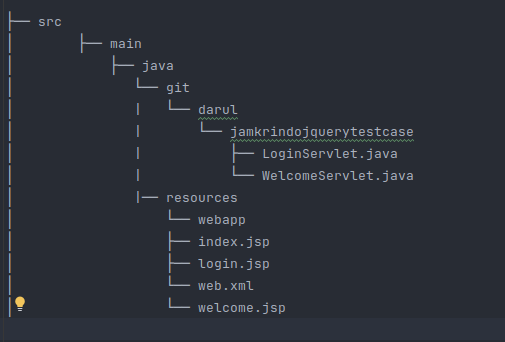

# Jamkrindo dynamic web app

Jamkrindo Test adalah sebuah aplikasi yang dibangun dengan menggunakan Jakarta EE (Java) yang memiliki fitur login. Dalam aplikasi ini, login dilakukan dengan username "admin" dan password "password". Aplikasi ini dijalankan menggunakan server aplikasi Apache Tomcat.

## Fitur

- **Login**: Aplikasi menyediakan halaman login dengan username dan password hardcoded.
- **Backend**: Dibangun menggunakan Jakarta EE (Java).
- **Server**: Aplikasi dijalankan di server Apache Tomcat.

## Prasyarat

Sebelum menjalankan aplikasi ini, pastikan bahwa Anda telah menginstal beberapa perangkat lunak berikut:

- **Java Development Kit (JDK)** versi 8 atau lebih tinggi
- **Apache Tomcat** versi 9 atau lebih tinggi

## Instalasi

Ikuti langkah-langkah berikut untuk menginstal dan menjalankan aplikasi ini:

### 1. Install Apache Tomcat

Jika Anda belum menginstal Apache Tomcat, ikuti langkah-langkah berikut:

#### a. Unduh Apache Tomcat

- Kunjungi halaman unduh Apache Tomcat di [https://tomcat.apache.org/download-90.cgi](https://tomcat.apache.org/download-90.cgi)
- Pilih versi Tomcat 9 (atau versi yang lebih tinggi).
- Unduh file zip atau tar.gz sesuai dengan sistem operasi Anda.

#### b. Ekstrak File

- Setelah unduhan selesai, ekstrak file Tomcat ke dalam folder pilihan Anda.
    - **Windows**: Gunakan aplikasi seperti WinRAR atau 7-Zip.
    - **Linux/Mac**: Gunakan perintah `tar -xvzf apache-tomcat-9.x.x.tar.gz` untuk mengekstrak file.

#### c. Konfigurasi Variabel Lingkungan (Opsional)

Untuk memudahkan akses ke Tomcat dari terminal (CLI), Anda bisa menambahkan `bin` folder ke dalam variabel PATH:

- **Windows**: Tambahkan `C:\path\to\tomcat\bin` ke dalam variabel PATH.
- **Linux/Mac**: Tambahkan `export PATH=$PATH:/path/to/tomcat/bin` ke dalam file `~/.bashrc` atau `~/.zshrc`.

### 2. Menjalankan Aplikasi

#### a. Menyiapkan Project

1. Clone atau salin project ke dalam folder lokal Anda.
2. Pastikan Anda memiliki file `WAR` hasil build project Anda. Jika Anda menggunakan IDE seperti IntelliJ IDEA atau Eclipse, pastikan untuk membuild project Anda menjadi file `WAR`.

#### b. Menyebarkan Aplikasi ke Tomcat

1. Salin file `WAR` hasil build ke dalam folder `webapps` di instalasi Tomcat.
2. Nama file `WAR` Anda seharusnya seperti `jamkrindo-test.war`.

#### c. Menjalankan Tomcat

1. Masuk ke folder `bin` di dalam direktori instalasi Tomcat.
2. Jalankan Tomcat:
    - **Windows**: Klik dua kali `startup.bat` atau jalankan `startup.bat` di terminal.
    - **Linux/Mac**: Jalankan perintah `./startup.sh` di terminal.

3. Setelah Tomcat berhasil dijalankan, buka browser dan akses aplikasi dengan alamat berikut:
   hhttp://localhost:8080/jamkrindo_jquery_test_case_war_exploded

### 3. Login ke Aplikasi

Pada halaman login, masukkan username dan password berikut untuk masuk:

- **Username**: `admin`
- **Password**: `password`

Aplikasi akan menyambut Anda dengan halaman setelah login berhasil.

## Struktur Direktori

Berikut adalah struktur direktori dari aplikasi ini:

## Teknologi yang Digunakan

- **Jakarta EE (Java)**: Framework Java untuk membangun aplikasi enterprise.
- **Apache Tomcat**: Server aplikasi untuk menjalankan aplikasi web Java.
- **JSP (JavaServer Pages)**: Digunakan untuk tampilan antarmuka pengguna.

## Troubleshooting

### 1. Tomcat Tidak Menyala

Jika Tomcat tidak dapat dijalankan, pastikan:
- **Port 8080 tidak diblokir** oleh firewall atau aplikasi lain.
- **Variabel `JAVA_HOME` sudah diatur dengan benar** di sistem Anda.

### 2. Login Tidak Berhasil

Jika login gagal, pastikan:
- Anda menggunakan username `admin` dan password `password` sesuai dengan yang sudah di-hardcode di dalam aplikasi.

## Kontak

Jika Anda memiliki pertanyaan atau masalah, jangan ragu untuk menghubungi kami melalui email: ahmaddarul72@gmail.com.
